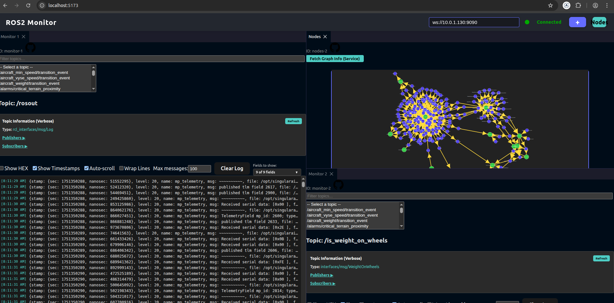

# ROS Cockpit

This repository contains the `ros-cockpit` project.

For detailed documentation on how to use the `ros-cockpit` Docker image, please refer to the [Docker README](docker/README.md).

A web-based monitoring interface for ROS2 systems using React and rosbridge.

## Features

- **Real-time Topic Monitoring**: Subscribe to ROS2 topics and view messages in real-time
- **Message Visualization**: Display messages in JSON format with optional hexadecimal view
- **Topic Information**: Get detailed verbose information about topics including publishers and subscribers
- **Chart Visualization**: Plot numeric data from topic messages
- **Node Graph**: Visualize the ROS2 node graph with D3.js
- **Connection Status**: Real-time connection status indicator
- **Dynamic Host Configuration**: Configure rosbridge host via UI

## Screenshot



## Topic Information Service

The application includes a custom ROS2 service that provides verbose topic information directly in the web interface. This service:

- Executes `ros2 topic info --verbose` for selected topics
- Parses the output to extract publisher and subscriber information
- Returns structured data that can be displayed in the web UI
- Runs automatically when the Docker container starts

### What you'll see:

- **Topic Type**: The message type (e.g., `std_msgs/String`)
- **Publishers**: List of nodes publishing to the topic with connection counts
- **Subscribers**: List of nodes subscribing to the topic with connection counts
- **Real-time Updates**: Refresh button to get updated information

## Quick Start

### Using Docker Compose (Recommended)

This is the easiest and most powerful way to run the entire application stack, including the frontend, ROS services, and rosbridge.

1. **Run the Application**:
   From the root of the project, simply run:
   ```bash
   docker-compose up --build
   ```
   This will build the necessary images and start all services.

2. **Access the Web Interface**:
   - **Frontend**: Open [http://localhost:5173](http://localhost:5173) in your browser.
   - **ROS Bridge**: The rosbridge is available at `ws://localhost:9090`. The frontend should connect to this endpoint by default.

### Adding Custom Interfaces (Production/Deployment)

For production environments, the recommended way to add custom ROS2 interfaces is by installing pre-compiled Debian (`.deb`) packages inside the container at startup. This is controlled via the `SETUP_COMMAND` environment variable in `docker-compose.yaml`.

This approach avoids compiling source code inside the production container and offers two flexible methods, both documented within `docker-compose.yaml`:

#### Method 1: Download and Install from a URL

This is the most common method. You can provide a command that downloads the `.deb` package from a secure location (like a GitLab package registry) and then installs it.

1.  **Prepare your `.env` file**:
    If your download requires authentication, create a file named `.flng.env` in the project root and add any necessary secrets.
    ```
    # ./.flng.env
    GITLAB_ACCESS_TOKEN=your_private_gitlab_token
    ```

2.  **Configure `docker-compose.yaml`**:
    Use the `SETUP_COMMAND` in the `environment` section. The `${GITLAB_ACCESS_TOKEN}` will be automatically sourced from your `.env` file.

    ```yaml
    environment:
      SETUP_COMMAND: 'curl --header "PRIVATE-TOKEN: ${GITLAB_ACCESS_TOKEN}" -o interfaces.deb "https://your.gitlab.com/..." && apt-get install -y ./interfaces.deb'
    ```

#### Method 2: Install from a Mounted Local Directory

If you have the `.deb` files locally, you can mount the directory into the container and install them from there.

1.  **Place your packages**:
    Create a directory (e.g., `custom_packages`) in the project root and place your `.deb` files inside.

2.  **Configure `docker-compose.yaml`**:
    Comment out the download command and use the volume-based installation method instead. Make sure to also uncomment the `volumes` section.

    ```yaml
    environment:
      # SETUP_COMMAND: 'curl ...' # Keep this commented out
      SETUP_COMMAND: 'apt-get install -y /debs/*.deb'

    volumes:
      - ./custom_packages:/debs:ro
    ```

#### Relaunch the Service

Once you have configured your chosen method, restart the service to apply the changes. Since the image is pre-built, you don't need to use `--build`.

```bash
docker-compose up -d --force-recreate
```

To provide maximum flexibility, the `ros2_bridge` container can execute a custom shell command during startup. This allows you to install dependencies or custom interfaces using any method you need (`curl`, `wget`, `scp`, etc.).

This is controlled via the `SETUP_COMMAND` environment variable.

1.  **Define the Command**:
    In your `docker-compose.yaml` file, add the `SETUP_COMMAND` to the `environment` section of the `ros2_bridge` service. The value should be a single-line string containing the full command to execute.

2.  **Provide Necessary Credentials**:
    If your command needs secrets (like an access token), pass them as separate environment variables for security.

**Example: Installing a `.deb` package from a private GitLab artifact**

```yaml
services:
  ros2_bridge:
    # ... (rest of the service configuration)
    environment:
      # The command downloads the .deb, installs it, and cleans up.
      - SETUP_COMMAND=curl --header "PRIVATE-TOKEN: ${GITLAB_ACCESS_TOKEN}" -fSL -o /tmp/interfaces.deb "https://<your-gitlab-url>" && apt-get install -y /tmp/interfaces.deb && rm /tmp/interfaces.deb
      
      # Pass the token securely from your host environment or a .env file
      - GITLAB_ACCESS_TOKEN=${GITLAB_ACCESS_TOKEN}
```

**How it Works:**
- The `entrypoint.sh` script inside the container will check for the `SETUP_COMMAND` variable.
- If it exists, the script will run `apt-get update` and then execute your command using `eval`.
- This gives you complete control to install packages from any source before the main ROS services are launched.

### Manual Setup

1. **Install dependencies**:
   ```bash
   npm install
   ```

2. **Start the development server**:
   ```bash
   npm run dev
   ```

3. **Start rosbridge** (in a separate terminal):
   ```bash
   ros2 launch rosbridge_server rosbridge_websocket_launch.xml
   ```

4. **Start the topic info service** (in another terminal):
   ```bash
   python3 ros2_utils/topic_info_service.py
   ```

## Usage

1. **Connect to ROS2**: Enter the rosbridge WebSocket URL (default: ws://127.0.0.1:9090)
2. **Select a Topic**: Choose from the list of available topics
3. **View Information**: 
   - **Messages**: See real-time message data
   - **Topic Info**: Get detailed publisher/subscriber information
   - **Chart**: Plot numeric fields from messages
   - **Nodes**: View the ROS2 node graph

## Architecture

- **Frontend**: React with Vite
- **ROS2 Communication**: rosbridge WebSocket interface
- **Topic Info Service**: Custom ROS2 service for verbose topic information
- **Visualization**: Chart.js for plots, D3.js for node graphs

## Development


### Building for Production

```bash
npm run build
```

The built files will be in the `dist/` directory.

## Troubleshooting

### Connection Issues

- Ensure rosbridge is running: `ros2 launch rosbridge_server rosbridge_websocket_launch.xml`
- Check the WebSocket URL in the UI
- Verify ROS2 topics are being published

### Topic Information Not Available

- The topic info service runs automatically in Docker
- For manual setup, run: `python3 ros2_utils/topic_info_service.py`
- Check that the service is available: `ros2 service list | grep get_topic_info`

### Build Issues

- Clear node_modules and reinstall: `rm -rf node_modules && npm install`
- Check for missing dependencies in package.json

## Contributing

1. Fork the repository
2. Create a feature branch
3. Make your changes
4. Test thoroughly
5. Submit a pull request

## License

This project is licensed under the MIT License.
