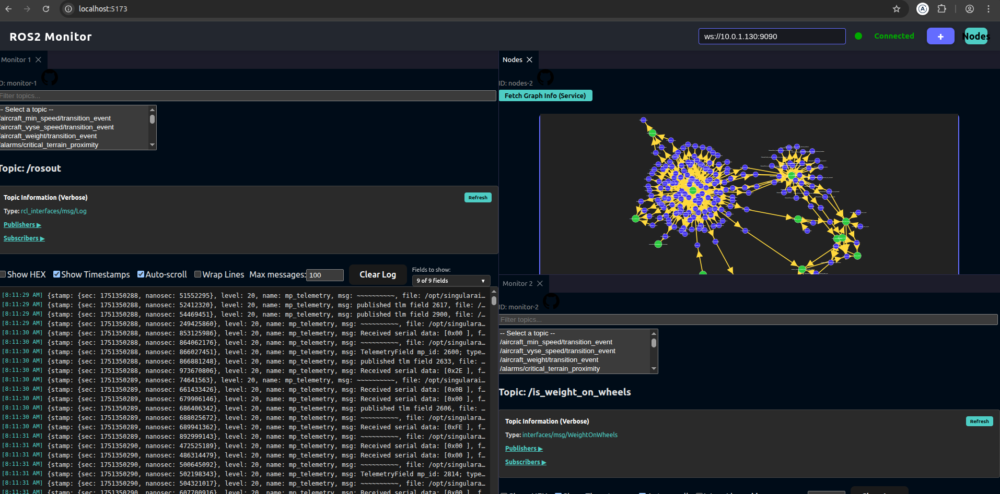

# ROS Cockpit Docker Image

This documentation provides instructions on how to use the `ros-cockpit` Docker image.

## Overview

`ros-cockpit` is a web-based tool for monitoring and interacting with ROS2 systems. This Docker image provides a convenient way to run `ros-cockpit` without needing to set up a full ROS2 environment.

## How to Use

### ROS2 Interface Packages

For `ros-cockpit` to properly display messages and topics from your ROS2 system, it needs access to the definitions of the ROS2 interface packages (e.g., `.msg`, `.srv`, `.action` files). There are two primary ways to make these available within the `ros-cockpit` Docker container:

1.  **Using `SETUP_COMMAND` (Recommended for CI/CD or specific package installations):**
    You can use the `SETUP_COMMAND` environment variable in your `docker run` or `docker-compose.yaml` configuration to execute commands inside the container during startup. This is useful for installing `.deb` packages containing your ROS2 interfaces or cloning repositories.

    Example (from `docker-compose.yaml`):
    ```yaml
    environment:
      SETUP_COMMAND: '# Add your package installation commands here, e.g., downloading .deb files or installing from a custom source.'
    ```

2.  **Mounting Volumes (Recommended for local development):**
    You can mount a local directory containing your ROS2 workspace (or just the installed interface packages) into the Docker container. This makes the interfaces directly accessible.

    Example (from `docker-compose.yaml`):
    ```yaml
    volumes:
      - "./path/to/your/ros2_workspace/install:/opt/ros2_interfaces:ro"
    ```
    Replace `./path/to/your/ros2_workspace/install` with the actual path to your `install` directory of your ROS2 workspace.

### Pulling the Image

You can pull the `ros-cockpit` Docker image from Docker Hub:

```bash
docker pull singularaircraft/ros-cockpit:latest
```

### Running the Container

To run the `ros-cockpit` container, you can use the following command:

```bash
docker run -p 5173:5173 -p 9090:9090 singularaircraft/ros-cockpit:latest
```

This will start the `ros-cockpit` application, accessible via your web browser at `http://localhost:5173`.

### Connecting to a ROS2 System

Once the `ros-cockpit` application is running, you can connect it to your ROS2 system by entering the WebSocket URL of your ROS2 bridge (e.g., `ws://<your_ros2_bridge_ip>:9090`) in the `ros-cockpit` interface. Make sure that port `9090` is accessible from the container to your ROS2 bridge.

## Running with Docker Compose

For a more persistent and configurable setup, you can use Docker Compose. Create a `docker-compose.yaml` file with the following content:

```yaml
version: '3.8'
services:
  ros-cockpit:
    container_name: ros_cockpit
    restart: always
    pull_policy: always
    image: singularaircraft/ros-cockpit:latest
    ports:
      - "5173:5173"
      - "9090:9090"
    environment:
      # --- Option 1: Download and install packages ---
      # The command downloads a .deb from a private GitLab repo, installs it, and cleans up.
      SETUP_COMMAND: '# Add your package installation commands here, e.g., downloading .deb files or installing from a custom source.'

      # SETUP_COMMAND: 'apt-get install -y /debs/*.deb' # Example for installing from a mounted volume

    # --- [OPTIONAL] Mount local packages ---
    # Place your .deb files in a local directory (e.g., ./custom_packages)
    # and uncomment the following lines to make them available inside the container.
    # volumes:
    #   - ../custom_packages:/debs:ro

    # If your ROS2 bridge is on a different host, you might need to configure the network.
    # For example, if your ROS2 bridge is on the host machine and you're using host networking:
    # network_mode: "host"
    # Or, if you need to connect to a specific IP:
    # extra_hosts:
    #   - "ros2-bridge-host:192.168.1.100"

```

Then, run the following command in the same directory as your `docker-compose.yaml` file:

```bash
docker-compose up -d
```

This will start the `ros-cockpit` application in the background.

## Screenshot

Here's a screenshot of the `ros-cockpit` interface:


